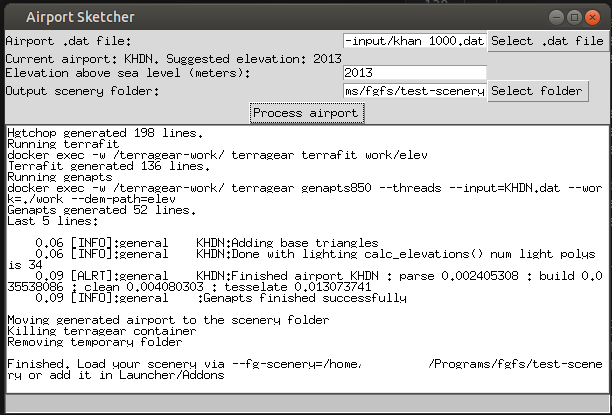

# FlightGear Airport Sketcher

This script allows you to convert airport from X-Plane .dat format to FlightGear scenery format.

Since this program does not rebuild terrain, your resulting airport will be a flat plane laying over the scenery. If the nearby scenery is not a perfect flat plane, some parts of your airport will hang in the air. Therefore, this tool only "sketches" the airport and cannot be a complete substitute to full TerraGear pipeline. However, it may be useful for people that want to quickly get a rough airport in their program.




As of now, the program does not automatically create .xml airport metadata.

One of the points of the program does not need any elevation data - it generates fake elevation data from constant elevation value.

# Dependencies

1. This program utilizes Docker TerraGear image to convert the airport data. Therefore, you need to have Docker installed. Additionally, on Linux, it should be able to start without sudo: see [this page](https://docs.docker.com/engine/install/linux-postinstall/) if you can only run docker with sudo.
2. This program has been written for FlightGear 2020.3 and tested on version 2020.3.18.
3. This program has been tested with python==3.11.4, numpy==1.25.2 on Ubuntu Linux. However, in theory you should be able to run it in Windows and slightly older versions of python3 and numpy, as nothing too new is used.

# Usage

1. [Create](https://developer.x-plane.com/tools/worldeditor/) or [download](https://gateway.x-plane.com/airports) your desired airport.
    - This tool supports `apt.dat` files versions from 10.00 to 11.00. If you downloaded newer file, you can convert it to older format using [WED](https://developer.x-plane.com/tools/worldeditor/).
    - This tool can convert only files containing exactly 1 airport with at least 1 runway.
2. Run the program via `python3 sketcher.py`.
3. Choose `apt.dat` file for your airport with `Select .dat file` button. Look at the log window and make sure no errors are displayed.
4. The program will suggest to you elevation level converted from .dat file. Input the elevation level. If your airport is too low and clips through scenery, try raising the elevation level.
    - In order to figure out elevation level for your airport, go to your airport with UFO and hover over the highest area. From menu, open `Debug -> browse internal properties` and find property `/position/ground-elev-m`. Round it up to a nearest integer and use it as the value.
5. Choose output scenery folder with `Select folder` button. This folder does not need to be empty.
6. Press `Process airport`. If there are no errors in the logs, your scenery should be able to load into FlightGear. A sample good log is below.

# Sample logs

The following text is an example of a log that converted the airport successfully.

```
Initialized
Docker image found: flightgear/terragear:ws20
Name: Yampa Valley
ICAO: KHDN
Elevation: 6602
Runway end detected @ 40.48671742, -107.2341122
Runway end detected @ 40.47566317, -107.20123399
Suggested elevation name: N40W108.hgt
Airport will appear in folders: w110n40/w108n40
==================================================
VALIDATION
==================================================
==================================================
ALL CHECKS PASSED
==================================================
Moving airport to /NavData/apt
Created tempdir /tmp/tmp1ge76nya
Copying files to tempdir
Creating fake elevation file with constant elevation = 2013 m
Running terragear container
docker run -v /tmp/tmp1ge76nya:/terragear-work/ -dit --name terragear flightgear/terragear:ws20 /bin/bash
ae7cfd381d617c378bb3ebeb7f250ef25b2e09ffcfa29d1d3521e3b63c3ac52a

Running hgtchop
docker exec -w /terragear-work/ terragear hgtchop 3 N40W108.hgt work/elev
Hgtchop generated 198 lines.
Running terrafit
docker exec -w /terragear-work/ terragear terrafit work/elev
Terrafit generated 136 lines.
Running genapts
docker exec -w /terragear-work/ terragear genapts850 --threads --input=KHDN.dat --work=./work --dem-path=elev
Genapts generated 52 lines.
Last 5 lines:

    0.06 [INFO]:general    KHDN:Adding base triangles
    0.06 [INFO]:general    KHDN:Done with lighting calc_elevations() num light polys is 34
    0.09 [ALRT]:general    KHDN:Finished airport KHDN : parse 0.001998583 : build 0.032340460 : clean 0.004021702 : tesselate 0.012566304
    0.09 [INFO]:general    :Genapts finished successfully

Moving generated airport to the scenery folder
Killing terragear container
Removing temporary folder

Finished. Load your scenery via --fg-scenery=/home/user/fgfs/test-scenery or add it in Launcher/Addons
```